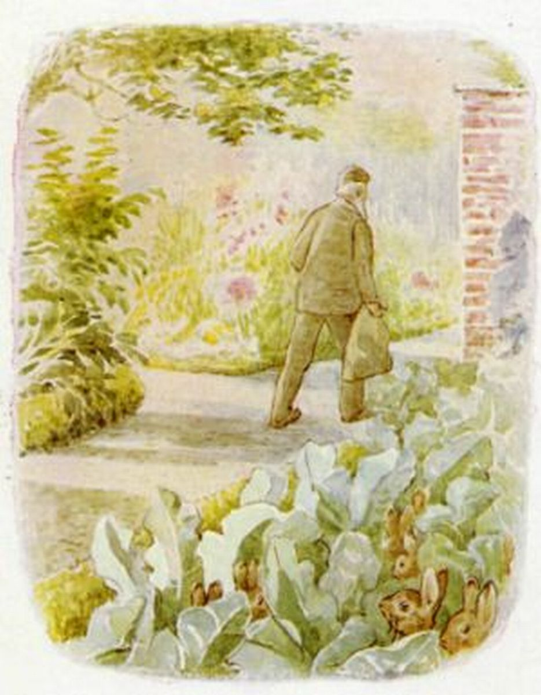
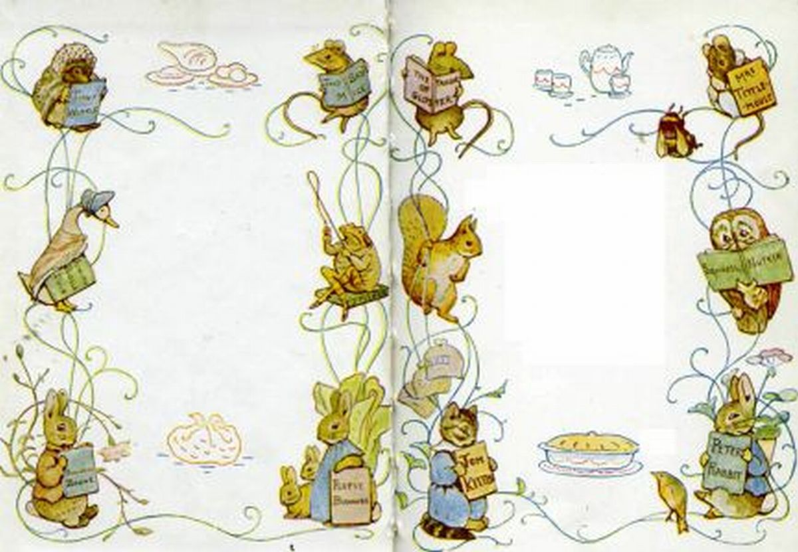

#THE TALE OF THE FLOPSY BUNNIES
##BY BEATRIX POTTER

###AUTHOR OF "THE TAIL OF PETER RABBIT" FOR EXAMPLE

##FOR ALL LITTLE FRIENDS
##OF
##MR. MCGREGOR & PETER & BENJAMIN

Thank you for finding our [Gatsby site](https://www.gatsbyjs.org/tutorial/).

Published in the Lilly Lab of: Benedicte, Ola, Lillian & CO. In the living room of the littlest white wood house at Rodeløkka, downtown Oslo, Norway, Europe, Earth.

All rights reserved for the kids by Project Gutenberg read more on our about page.

Go back to [the Front page](/) or click the parrot above to start reading.

