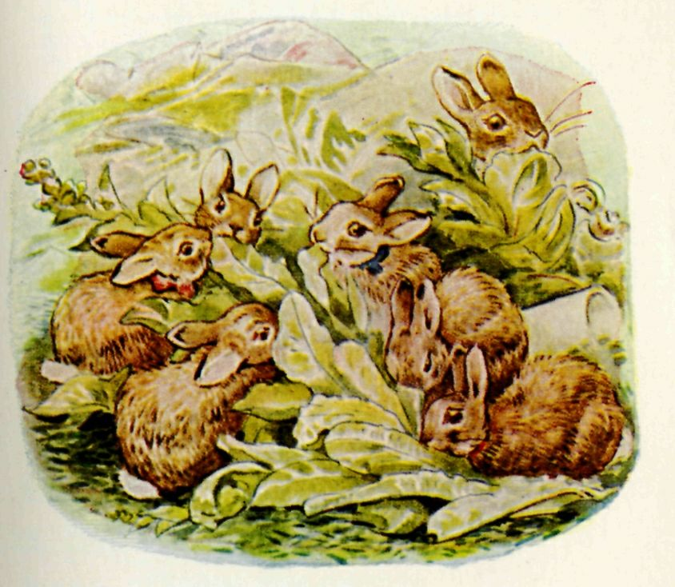

###Mr. McGregor's rubbish heap was a mixture. There were jam pots and paper bags, and mountains of chopped grass from the mowing machine (which always tasted oily), and some rotten vegetable marrows and an old boot or two. One day—oh joy!—there were a quantity of overgrown lettuces, which had "shot" into flower.

###The Flopsy Bunnies simply stuffed lettuces. By degrees, one after another, they were overcome with slumber, and lay down in the mown grass.
