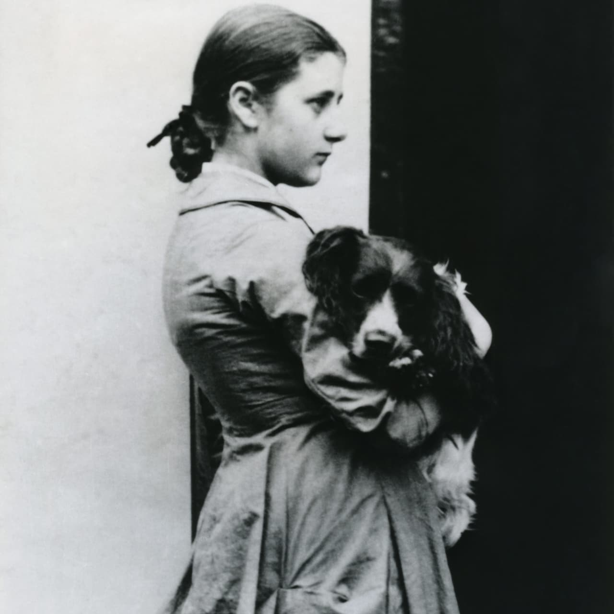

###Thank you for reading our Gatsby site. Now go build a Gatsby site yourself.
Read about how to build your own Gatsby site on [Gatsbyjs.org/tutorial/](https://www.gatsbyjs.org/tutorial/), all you need is a computer, time and the will to learn.

Potter at fifteen years with her springer spaniel, Spot. (CREDIT:  RUPERT POTTER/NATIONAL TRUST)

Published in the Lab of

Benedicte Raae, Ola Vea, Lillian Raae-Vea & CO. At

Rodeløkka, Oslo, Norway, Earth

ALL RIGHTS RESERVED
FOR THE KIDS

Read about COPYRIGHTS on [the About page](/about) of this book. Or go back to [the Front page](/) and read the book again. Or look at some of our other books at ...

